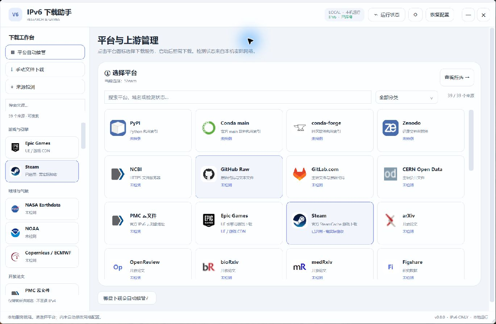
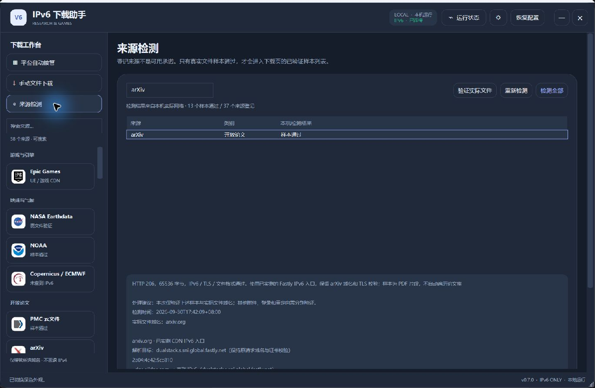

# IPv6 科研下载助手

**由 [ETO-ze](https://github.com/ETO-ze) 开发的 Windows 原生桌面下载工具。** 将选定科研服务、Epic Games / Unreal Engine 和 Steam 官方内容缓存的下载请求交给严格 IPv6 上游，查看真实检测结果、管理上游 IP，并在 IPv6 不可用时明确停止。

Go 网络引擎 + C# WPF 界面 · 单文件 EXE · 中文界面 · 本机运行 · 不打开浏览器

[下载 Windows 版](https://github.com/ETO-ze/ipv6-research-helper/releases/latest) · [使用手册](docs/USER-GUIDE.md) · [Steam 说明](docs/STEAM.md) · [构建说明](docs/DEVELOPMENT.md) · [本次验收记录](docs/acceptance/2026-10-05.md) · [问题反馈](https://github.com/ETO-ze/ipv6-research-helper/issues)



## 为什么做这个软件

下载大型引擎、科研软件、论文和数据时，想明确知道流量是否走 IPv6，而不必每次手动修改代理、查找 CDN 地址。这个项目把平台选择、域名接管、真实文件检测和上游 IP 管理放在同一个桌面窗口中。

当前版本为 **0.8.0**，处于早期发布阶段。列表登记了 **Epic + Steam + 37 类科研来源，共 39 项**，登记不代表该平台所有资源都可用。软件显示本机实际检测结果，不会把“DNS 查到了地址”当成“文件下载通过”。

Steam 新功能从本机日志发现官方缓存的精确域名，使用管理员权限写入 hosts，经本机双栈回环转发到官方 IPv6，不依赖 Clash。原软件国区 CDN 镜像未接入本版，失败候选也没有标成可用。操作、样本和边界见 [Steam 说明](docs/STEAM.md)；参考软件的配置与接口分析见 [只读分析](docs/ORIGINAL-SOFTWARE-ANALYSIS.md)。

## 已实现

| 功能 | 具体行为 |
|---|---|
| 平台图标列表 | 按分类浏览、搜索名称或域名、选择服务；缺失图标使用文字缩写 |
| 自动接管 | Epic/科研来源配合本机 Clash 规则模式；Steam 使用精确 hosts 域名接管，启动后在原客户端照常下载 |
| Steam 官方缓存 | 读取本机下载日志、手动刷新服务；双栈回环接管 HTTP/HTTPS，原样转发 TLS 和 HTTP/2，无需 Clash |
| 严格 IPv6 上游 | 助手下载和加密 DNS 连接使用 IPv6；失败不回退 IPv4 |
| 上游 IP 管理 | 列出候选 IPv6、实际解析目标；按域名固定 IP、拉黑、解除拉黑、恢复自动选择 |
| 来源诊断 | 分辨无 AAAA、DNS 超时、连接超时、TLS、授权、限流、格式和哈希问题 |
| 实际文件验证 | 从来源页载入公开样本，或输入已有权限的 HTTPS 文件链接 |
| 本机文件下载 | 任务进度、暂停/继续、断点处理、SHA256 计算和可选预期哈希校验 |
| Epic 验收 | 真实 UE 数据块校验、规则检查、拒绝 IPv4 目标和系统 TCP 采样 |
| Steam 样本验收 | 校验真实内容块的长度、响应头与独立 IPv6 传输参照 SHA256；与客户端实际接管证据分别核对 |
| 原生界面 | WPF 桌面窗口，浅色/深色主题，运行状态和恢复配置入口 |

## 快速开始

1. 从 [Releases](https://github.com/ETO-ze/ipv6-research-helper/releases/latest) 下载 `IPv6-Research-Helper-0.8.0-windows-x64.exe`。使用 Steam 接管时，右键“以管理员身份运行”；其他方式可按原入口启动。
2. **Steam**：先在 Steam 开始所需下载，再在助手点击 Steam 图标和“刷新下载服务器”，选择精确缓存服务。**Epic/科研来源自动接管**：需要本机已有可工作的 Clash for Windows 规则模式，原客户端须通过它联网。手动文件下载不需要 Clash。
3. 在“平台自动接管”选择服务/域名，查看检测状态和上游 IP，再启动接管。
4. 回到原网站或客户端继续下载。已有长连接可能需要暂停后继续，才会重新建立连接。
5. 使用结束点击“恢复配置”，或正常退出软件。

运行环境：Windows x64、.NET Framework 4.x WPF（建议 4.8 或更高）及可用 IPv6 网络。0.8.0 最终构建已完成本机管理员 Steam 下载及立即停止恢复验收，测试未覆盖所有 Windows 版本。普通使用无需安装 Go 或 Python；发布 EXE 尚未进行商业代码签名。详细操作见 [使用手册](docs/USER-GUIDE.md)。

## “纯 IPv6”的准确范围

```text
Epic / 科研客户端 → 本机 Clash → 本机助手 → 官方服务器 / CDN IPv6
Steam 精确下载域名 → hosts → 127.0.0.23 / ::1:80/443 → 助手 → 官方缓存 IPv6
                                                      └→ IPv6 加密 DNS
```

本机 `127.0.0.1`、`127.0.0.23` 和 `::1` 是进程间连接，不是外网 IPv4 回退。保证范围是**经过助手且属于本次接管精确域名的上游连接**。它不是整台电脑的 IPv4 防火墙，也不证明 CDN 到源站、路由器隧道内部或其他软件的协议。

- 一次接管一个平台/服务组；同域名下网页和文件都会受对应规则影响。
- Epic/科研来源中未使用代理的客户端，以及 UDP/QUIC、未登记重定向域名和其他进程不在保证范围内。
- HTTPS 保留原站证书校验，不安装根证书，不解密客户端 HTTPS。
- 不自动登录、不导入浏览器 Cookie、不绕过权限；403 和订阅限制仍需有效访问权限。
- Steam 仅覆盖本次选择的官方缓存域名。新增缓存需刷新、重新应用并在 Steam 暂停后继续；登录、商店、联机和未知域名不在保证范围内，不修改下载地区或凭据。
- 战网等其他游戏平台尚未实现。

## 0.8.0 Steam 新增范围与实测

2026-10-05，最终构建完成**管理员实际 Steam 下载接管**：25.452 秒、22 次采样中，Steam 回环连接观测 **120 次**，助手反向四元组匹配 **120 次**；助手公网 IPv6 观测 **120 次**，IPv4 **0 次**。六个官方缓存内容流累计增加 **250,120,379 字节**。这些是快照观测次数，短连接可能未被捕获，不代表整个 Steam 或全机流量。

最终构建 **8 项链路通过**，立即停止时 **6 条活动连接归零**，操作耗时约 **0.038 秒**，hosts 恢复后原文件哈希一致。最终构建固定 IP 后真实块校验通过；拉黑后 CONNECT 返回 502，目标上游新建连接为 0，原策略已恢复。内容块哈希是传输参照，非 Valve 发布者校验值，未解密最终游戏文件。

此前候选首次恢复遇到 hosts 文件替换占用，随后重试成功。最终版加入**先关闭受影响连接、Windows 原子替换最多 3 秒重试**，并已在实际下载中复验立即停止。完整记录见 [本次验收](docs/acceptance/2026-10-05.md) 和 [Steam 说明](docs/STEAM.md)。

洁净公开源码测试：**67 个顶层、115 项含子测试通过，Steam 21 个顶层，go vet 通过**。另有 2 项明确跳过：未开启的公网 Raw 测试，以及公开源码不分发版权样本的 UE 测试。最终 EXE 为 **9,227,776 字节**，SHA256：

```text
9DDD27EDE94DCAE4F8A060CED80D2395C156199D13CC6CFC47DDC50B20C3F439
```

## 0.7.0 历史验收：2026-09-30

0.7.0 在指定网络完成 Epic 7/7 项、37 类科研来源中的 13 个样本、arXiv 完整 PDF、原生界面及配置恢复检查。这些是当时的结果，不作为本版新增 Steam 功能的证明，也不保证平台全部资源可用。逐项记录见 [历史验收](docs/acceptance/2026-09-30.md)，样本出处见 [sample-provenance.md](sample-provenance.md)。



上图为 0.7.0 的历史诊断界面，作为布局参考；本轮 Steam 原生截图见页首。

## 源码和构建

| 路径 | 用途 |
|---|---|
| native/ | WPF 界面、主题、图标、内嵌引擎封装 |
| main.go、connect_http.go | 下载代理与 IPv6 连接 |
| dns_diagnostics.go、diagnostics.go | DNS 证据与错误分类 |
| research.go、research-sources.json | 科研来源、样本检测、下载任务 |
| routing.go、clash.go、upstreams.go | 接管、配置恢复、节点策略 |
| steam.go、steam_verification.go | Steam 官方缓存发现、hosts 接管和真实内容块验收 |
| verification.go、*_test.go | 实际文件验收和回归测试 |
| docs/、third-party/ | 使用、开发、验收文档与依赖许可 |

在 Windows 安装 Go 1.24 或更新版本，将 go 加入 PATH：

```powershell
go test ./...
go vet ./...
powershell -NoProfile -ExecutionPolicy Bypass -File scripts/build.ps1
```

输出 `output/IPv6-Research-Helper-0.8.0-windows-x64.exe`。可选真实样本、环境和 CI 边界见 [开发说明](docs/DEVELOPMENT.md)。

## 本地数据与反馈

引擎、配置备份、任务和日志位于 `%LOCALAPPDATA%\EpicIPv6Helper`；下载文件默认存入用户下载目录的 `IPv6科研下载`。软件无需云端账号，仓库不包含开发者的代理配置、下载历史或登录数据。签名 URL 可能保存在本机任务记录中，反馈前请删除敏感查询参数和个人路径。

反馈建议包含软件版本、来源名称、检测原因和脱敏截图。不要上传完整 Clash 配置、订阅地址、访问令牌、浏览器 Cookie 或私人文件。

## 作者与第三方内容

项目由 **ETO-ze** 开发维护，独立实现网络引擎与桌面界面。平台图标和名称用于标识相应服务，归各自权利人所有；本项目与这些平台无官方隶属或背书关系。

本仓库公开提供源码供查看，当前未授予统一开源许可证；如需再分发或商业使用，请联系作者。第三方依赖按其自身许可提供，见 [第三方说明](THIRD-PARTY-NOTICES.md)。
