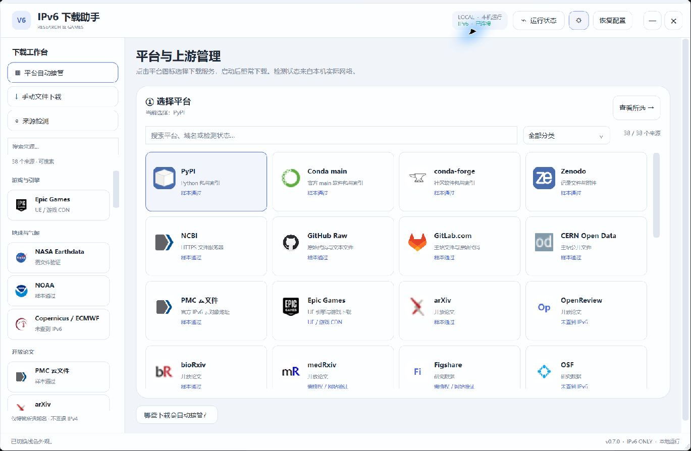

# IPv6 科研下载助手

**由 [ETO-ze](https://github.com/ETO-ze) 开发的 Windows 原生桌面下载工具。** 将选定科研服务和 Epic Games / Unreal Engine 的下载请求交给严格 IPv6 上游，查看真实检测结果、管理上游 IP，并在 IPv6 不可用时明确停止。

Go 网络引擎 + C# WPF 界面 · 单文件 EXE · 中文界面 · 本机运行 · 不打开浏览器

[下载 Windows 版](https://github.com/ETO-ze/ipv6-research-helper/releases/latest) · [使用手册](docs/USER-GUIDE.md) · [构建说明](docs/DEVELOPMENT.md) · [实测记录](docs/acceptance/2026-09-30.md) · [问题反馈](https://github.com/ETO-ze/ipv6-research-helper/issues)



## 为什么做这个软件

下载大型引擎、科研软件、论文和数据时，想明确知道流量是否走 IPv6，而不必每次手动修改代理、查找 CDN 地址。这个项目把平台选择、域名接管、真实文件检测和上游 IP 管理放在同一个桌面窗口中。

当前版本为 **0.7.0**，处于早期发布阶段。列表登记了 **Epic + 37 类科研来源**，登记不代表该平台所有资源都可用。软件显示本机实际检测结果，不会把“DNS 查到了地址”当成“文件下载通过”。

## 已实现

| 功能 | 具体行为 |
|---|---|
| 平台图标列表 | 按分类浏览、搜索名称或域名、选择服务；缺失图标使用文字缩写 |
| 自动接管 | 配合本机 Clash for Windows 规则模式，选平台、启动后在原客户端照常下载 |
| 严格 IPv6 上游 | 助手下载和加密 DNS 连接使用 IPv6；失败不回退 IPv4 |
| 上游 IP 管理 | 列出候选 IPv6、实际解析目标；按域名固定 IP、拉黑、解除拉黑、恢复自动选择 |
| 来源诊断 | 分辨无 AAAA、DNS 超时、连接超时、TLS、授权、限流、格式和哈希问题 |
| 实际文件验证 | 从来源页载入公开样本，或输入已有权限的 HTTPS 文件链接 |
| 本机文件下载 | 任务进度、暂停/继续、断点处理、SHA256 计算和可选预期哈希校验 |
| Epic 验收 | 真实 UE 数据块校验、规则检查、拒绝 IPv4 目标和系统 TCP 采样 |
| 原生界面 | WPF 桌面窗口，浅色/深色主题，运行状态和恢复配置入口 |

## 快速开始

1. 从 [Releases](https://github.com/ETO-ze/ipv6-research-helper/releases/latest) 下载 `IPv6-Research-Helper-0.7.0-windows-x64.exe`，直接双击。
2. 自动接管需要本机已有可工作的 **Clash for Windows 规则模式**，原客户端须通过它联网。仅使用本软件手动下载时不需要 Clash。
3. 在“平台自动接管”点击平台图标，选择服务/域名，查看检测状态和上游 IP，再启动接管。
4. 回到原网站或客户端继续下载。已有长连接可能需要暂停后继续，才会重新建立连接。
5. 使用结束点击“恢复配置”，或正常退出软件。

运行环境：Windows x64、.NET Framework 4.x WPF（建议 4.8 或更高）及可用 IPv6 网络。正式验收在当前 Windows 主机完成，未承诺所有 Windows 版本兼容。普通使用无需安装 Go 或 Python；发布 EXE 尚未进行商业代码签名。详细操作见 [使用手册](docs/USER-GUIDE.md)。

## “纯 IPv6”的准确范围

```text
原客户端 → 本机 Clash → 本机助手 → 官方服务器 / CDN 的 IPv6 地址
                                   └→ DNS-over-HTTPS 的 IPv6 地址
```

本机 `127.0.0.1` 是进程间连接，不是外网 IPv4 回退。保证范围是**经过助手且属于已登记域名的上游连接**。它不是整台电脑的 IPv4 防火墙，也不证明 CDN 到源站、路由器隧道内部或其他软件的协议。

- 一次接管一个平台/服务组；同域名下网页和文件都会受对应规则影响。
- 未使用代理的客户端、UDP/QUIC、未登记重定向域名和其他进程不在保证范围内。
- HTTPS 保留原站证书校验，不安装根证书，不解密客户端 HTTPS。
- 不自动登录、不导入浏览器 Cookie、不绕过权限；403 和订阅限制仍需有效访问权限。
- Steam、战网等其他游戏平台尚未实现。当前游戏接管范围是 Epic。

## 2026-09-30 验收概况

| 检查 | 结果 |
|---|---|
| 本地 Go 测试 | 58 项通过（含子测试及可选 UE 样本测试），go vet 通过 |
| Epic 实际链路 | 7/7 项通过；HTTP/Akamai、HTTPS/CloudFront 真实数据块校验通过 |
| Epic TCP 采样 | 10 秒采样观察到 2 个 IPv6 外网远端、0 个 IPv4；快照可能漏掉短连接 |
| 37 类科研来源 | 13 个样本通过、16 个未查到 IPv6、4 个需授权/网站验证、3 个需文件验证、1 个连接超时 |
| arXiv 完整 PDF | 2,215,244 字节；独立 IPv6、助手代理、原生 UI 下载的 SHA256 一致 |
| 原生交互补验 | “验证实际文件”跳转和填充、完整下载、深色下载页和诊断页通过 |
| 配置恢复 | 退出恢复后原 Clash 配置与测试前基线哈希一致 |

通过样本包括 PyPI、Conda main、conda-forge、Zenodo、NCBI、GitHub Raw、GitLab.com、CERN、PMC、arXiv、bioRxiv、IEEE 公开作者稿、NOAA GOES 指南。部分是小文件或片段；IEEE 作者稿通过不代表所有订阅论文通过，NOAA 指南通过不代表所有 NOAA 产品通过。

这些是指定日期、指定网络的实测，不能保证今后或其他网络始终成功。逐来源结果和边界见 [验收报告](docs/acceptance/2026-09-30.md)，上游映射与样本出处见 [sample-provenance.md](sample-provenance.md)。


## 源码和构建

| 路径 | 用途 |
|---|---|
| native/ | WPF 界面、主题、图标、内嵌引擎封装 |
| main.go、connect_http.go | 下载代理与 IPv6 连接 |
| dns_diagnostics.go、diagnostics.go | DNS 证据与错误分类 |
| research.go、research-sources.json | 科研来源、样本检测、下载任务 |
| routing.go、clash.go、upstreams.go | 接管、配置恢复、节点策略 |
| verification.go、*_test.go | 实际文件验收和回归测试 |
| docs/、third-party/ | 使用、开发、验收文档与依赖许可 |

在 Windows 安装 Go 1.24 或更新版本，将 go 加入 PATH：

```powershell
go test ./...
go vet ./...
powershell -NoProfile -ExecutionPolicy Bypass -File scripts/build.ps1
```

输出 `output/IPv6-Research-Helper-0.7.0-windows-x64.exe`。可选真实样本、环境和 CI 边界见 [开发说明](docs/DEVELOPMENT.md)。

## 本地数据与反馈

引擎、配置备份、任务和日志位于 `%LOCALAPPDATA%\EpicIPv6Helper`；下载文件默认存入用户下载目录的 `IPv6科研下载`。软件无需云端账号，仓库不包含开发者的代理配置、下载历史或登录数据。签名 URL 可能保存在本机任务记录中，反馈前请删除敏感查询参数和个人路径。

反馈建议包含软件版本、来源名称、检测原因和脱敏截图。不要上传完整 Clash 配置、订阅地址、访问令牌、浏览器 Cookie 或私人文件。

## 作者与第三方内容

项目由 **ETO-ze** 开发维护，独立实现网络引擎与桌面界面。平台图标和名称用于标识相应服务，归各自权利人所有；本项目与这些平台无官方隶属或背书关系。

本仓库公开提供源码供查看，当前未授予统一开源许可证；如需再分发或商业使用，请联系作者。第三方依赖按其自身许可提供，见 [第三方说明](THIRD-PARTY-NOTICES.md)。
