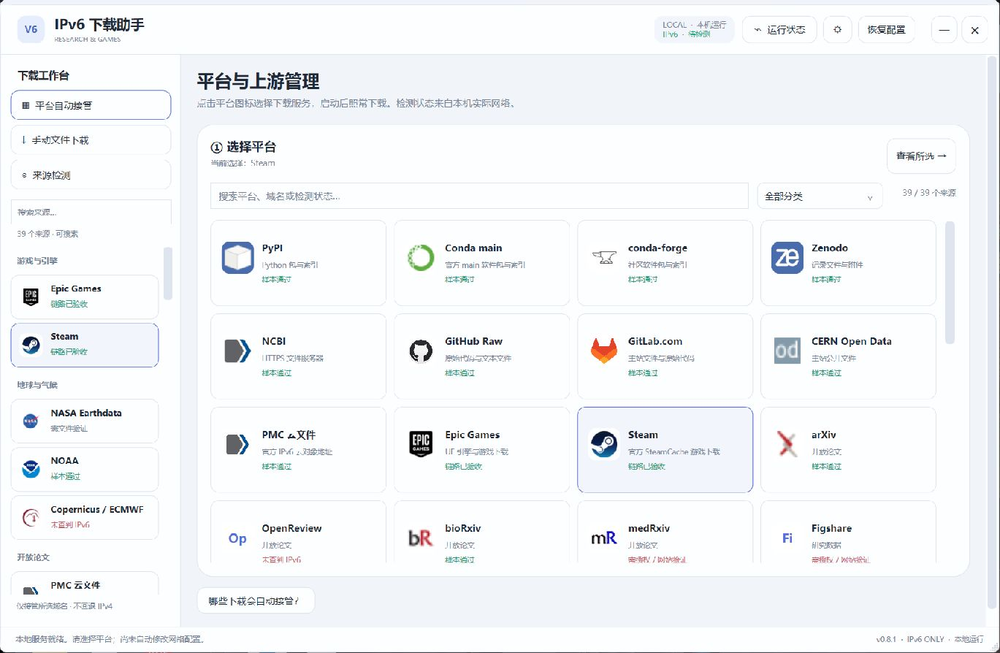
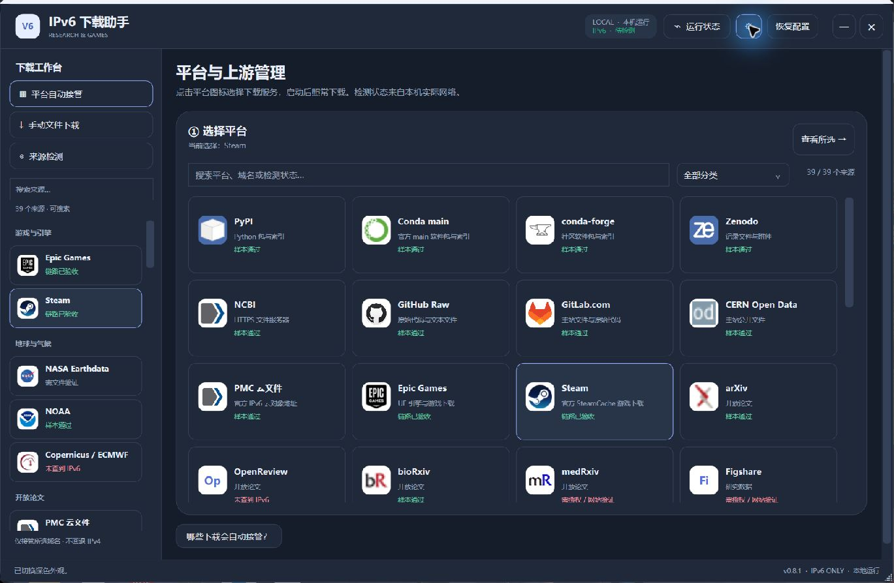

# 0.8.1 验收记录：2026-10-06

时间按 Asia/Shanghai 记录。平台列表为 **Epic + Steam + 37 类科研来源，共 39 项**。

0.8.1 修复 Steam/Epic 最近验收结果的保存、重载和原生界面展示，不改变 Steam 路由算法。**本次 Steam 8 项、Epic 7 项真实样本链路通过**；两次验证均未启用 hosts/Clash，因此不将它们写成新版完整客户端接管已通过。0.8.0 的实际 Steam 客户端接管、停止和恢复证据另见 [历史记录](2026-10-05.md)。

## 最终构建与源码检查

文件：`IPv6-Research-Helper-0.8.1-windows-x64.exe`，**9,247,744 字节**，WPF 文件版本及产品版本均为 **0.8.1.0**。本机读取文件长度和 SHA256 核对一致：

```text
C601ACBBEC514A43CED314D02CF49ACC8B530CBD18998F6BD4FD395AEFDF5B1B
```

内嵌 Go 引擎资源 SHA256：`CE97CFBEAFCA45889A55F0C453E2BFBACFAEFB85EFC2652CCE03232FFBB6269C`。

| 检查 | 结果 |
| --- | --- |
| 洁净公开源码默认测试 | 76 个顶层、162 项含子测试通过，0 失败 |
| 明确跳过 | 2 项：`TestLiveResearchRaw` 公网开关未开启；`TestRealUEChunkIntegrity` 的第三方 UE 内容块不随公开源码分发 |
| `go vet ./...` | 通过 |

含子测试的总数已经包含顶层测试，不能重复相加。默认测试与本机在线样本验收分别记录，跳过项不算真实公网验证通过。

## 本机真实样本链路

| 平台 | 验收完成时间 | 结果与范围 |
| --- | --- | --- |
| Steam | `2026-10-06T16:39:10.7133813+08:00` | 8 项通过，真实 Steam 内容块与助手 IPv6 链路；未启用 hosts |
| Epic | `2026-10-06T16:39:21.0415168+08:00` | 7 项通过，真实 UE 数据块与助手 IPv6 链路；未启用 Clash 接管 |

逐项脱敏记录：[Steam 链路](steam-chain-2026-10-06.json)、[Epic 链路](epic-chain-2026-10-06.json)。

Steam 内容块参照 SHA256 来自官方缓存的独立传输实测，非 Valve 发布者校验值或数字签名，未解密最终游戏文件。Epic 样本通过也不等于整套 UE 安装完成。这些结果不保证所有下载域名、全部客户端流量或未来网络可用。

## 科研来源

新版完成全部 **37 类**来源检测，保留真实结果，没有将登记平台或 DNS 候选统一标记为可用：

| 当前结果 | 来源数量 |
| --- | --- |
| 样本通过 | 13 |
| 无 IPv6 | 17 |
| 需授权 | 4 |
| 需文件验证 | 2 |
| 连接超时 | 1 |
| 合计 | 37 |

样本通过只覆盖本次具体资源。来源状态独立于 Steam/Epic 的验收记录；授权、限流、临时链接和 CDN 调度变化仍可能影响后续下载。

逐来源公共结果见 [科研样本记录](research-samples-2026-10-06.json)。

## 保存与原生界面

新版已实际启动并核对旧验收报告迁移、平台状态文字和对应颜色。Steam/Epic 的结果记录包含 `status`、`passed`、`checked`、`scope`、`detail`、`version`；保留最近一次实际结果，最近失败覆盖旧成功。启用接管、DNS 成功或仅存在报告文件不能冒充实际通过。

**最终 EXE 重启保持检查已通过。** 正常退出、替换桌面文件后重新启动，版本仍为 0.8.1，Steam/Epic 的通过状态及验收时间完全保持；37 个科研来源的 `id`、`status`、`checked` 逐项一致，仍有 13 个样本通过，检测已完成（`checking=false`）。EXE 的长度和 SHA256 均保持上述值。

停止接管与历史验收结果分别显示；保存成功不等于未来链路永远成功。科研来源继续显示各自样本和诊断状态。

本页只公开必要版本、摘要和测试范围，不包含私人运行日志、账号、个人网络地址或授权请求。




